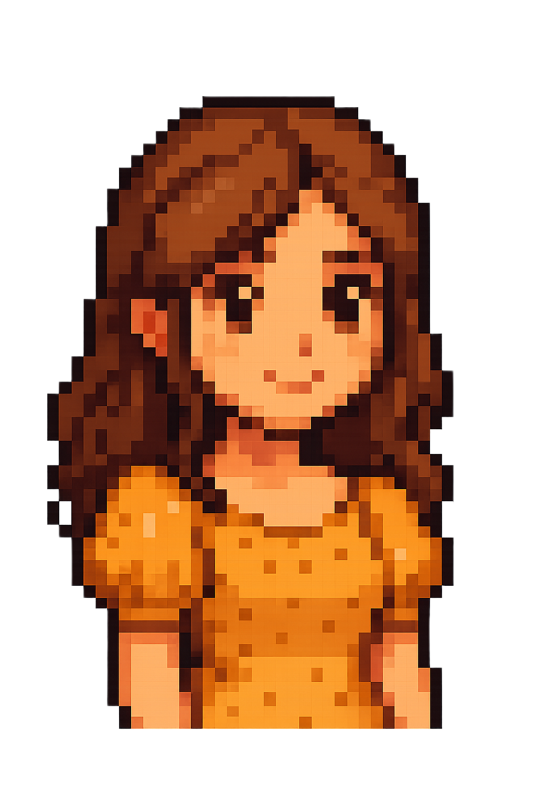

<html lang="en">
<head>
<meta charset="utf-8" />
<meta name="viewport" content="width=device-width,initial-scale=1" />
<title>Martina Perriera's Portfolio</title>

<!-- Fonts -->
<link href="https://fonts.googleapis.com/css2?family=Press+Start+2P&family=Space+Mono:wght@400;700&display=swap" rel="stylesheet">

<!-- Howler.js for sounds -->

</head>
<body>

<!-- Theme toggle -->

  🌙

  <!-- Start Screen -->
  

    
    <!-- Speech Bubble -->
    

      

        Ciao! Welcome to my AI-powered creative space. Ready to explore?
      

    

    
    <!-- Start Button -->
    <button class="start-btn" id="startBtn">START</button>
    
    <!-- Loading Bar -->
    

      
LOADING...

      

        

      

      
0%

    

  

  
  <!-- Main Content -->
  

    

      <h1 class="name">Martina Perriera</h1>
      
AI enthusiast blending language, art, and technology.

      
      <nav class="nav">
        <button class="nav-btn active" data-section="about">ABOUT</button>
        <button class="nav-btn" data-section="projects">PROJECTS</button>
        <button class="nav-btn" data-section="contact">CONTACT</button>
      </nav>
    

    
    <!-- About Section -->
    <section id="about" class="section active">
      <h2 class="section-title">ABOUT ME</h2>
      

        

          I am a language & data specialist combining a humanistic background with a growing technical toolkit. I work at the intersection of prompt design, content evaluation and creative AI experimentation. My work blends rigorous linguistic thinking with a passion for visual storytelling.
        

        
        

          <h3 class="skills-title">SKILLS & TOOLS</h3>
          

            PROMPT ENGINEERING
            LLM EVALUATION
            MIDJOURNEY
            DALL·E
            CANVA
            PYTHON
            COPYWRITING
          

        

      

    </section>
    
    <!-- Projects Section -->
    <section id="projects" class="section">
      <h2 class="section-title">PROJECTS</h2>
      

        

          <h3 class="project-title">Mindful Journals — AI Book Series</h3>
          
Prompt design and iterative refinement to generate cover art and low-content interior pages for a mindfulness journal series.

          

            MIDJOURNEY
            CHATGPT
          

        

        
        

          <h3 class="project-title">Prompt Engineering & Model Evaluation</h3>
          
Freelance evaluation and refinement of prompts for LLMs, focusing on clarity, instruction adherence and factual accuracy.

          

            GPT
            ANNOTATION
          

        

        
        

          <h3 class="project-title">AI x Cinema — Visual Tribute</h3>
          
Generative visual experiments inspired by European cinema; poster-style images combining poetic motifs and cinematic references.

          

            DALL·E
            PHOTOSHOP
          

        

        
        

          <h3 class="project-title">Social Visuals & Copy</h3>
          
AI-assisted social concepts combining generated visuals and copywriting to promote sustainable creative practices.

          

            CHATGPT
            CANVA
          

        

      

    </section>
    
    <!-- About Section -->
    <section id="about" class="section">
      <h2 class="section-title">ABOUT ME</h2>
      

        

          I am a language & data specialist combining a humanistic background with a growing technical toolkit. I work at the intersection of prompt design, content evaluation and creative AI experimentation. My work blends rigorous linguistic thinking with a passion for visual storytelling.
        

        

          Selected for the Schuman Traineeship Programme (European Parliament, Luxembourg, 2024). Experience in academic project coordination, festival volunteering (Cinema City Palermo) and international presentations (conference in Salamanca).
        

        
        

          <h3 class="skills-title">SKILLS & TOOLS</h3>
          

            PROMPT ENGINEERING
            LLM EVALUATION
            MIDJOURNEY
            DALL·E
            CANVA
            PYTHON
            COPYWRITING
          

        

      

    </section>
    
    <!-- Contact Section -->
    <section id="contact" class="section">
      <h2 class="section-title">GET IN TOUCH</h2>
      

        
Interested in collaborating or want to see more work? Drop me a message!

        <form class="contact-form" id="contactForm">
          <input type="text" class="form-input" placeholder="Your Name" id="nameInput" required>
          <input type="email" class="form-input" placeholder="Your Email" id="emailInput" required>
          <textarea class="form-textarea" placeholder="Your Message" id="messageInput" required></textarea>
          <button type="submit" class="submit-btn">SEND MESSAGE</button>
        </form>
      

    </section>
    
    <!-- Footer -->
    <footer class="footer">
      
Based in Palermo, Italy 🇮🇹

      

        <a href="#" class="footer-link" id="cvLink">DOWNLOAD CV</a>
        <a href="https://linkedin.com/in/yourprofile" class="footer-link" target="_blank">LINKEDIN</a>
        <a href="mailto:your.email@example.com" class="footer-link">EMAIL</a>
      

    </footer>
  

</body>
</html>
